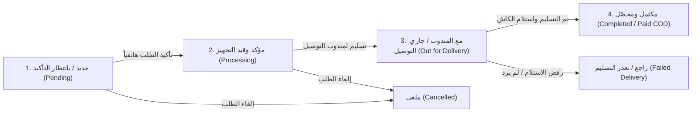

# خطة التعديلات الأساسية للنظام (Fixes Plan 01: Core System Adjustments)

هذه الوثيقة تمثل الخطة الشاملة والمفصلة لتنفيذ التعديلات والقرارات التشغيلية المطلوبة في متجر ولوحة تحكم **نسائم ليبيا**:

1. **إخفاء الدفع الإلكتروني بالكامل** من المتجر ولوحة التحكم.
2. **تفعيل وتكامل بيانات العطور الحسية (محدد النوتات، مؤشرات الثبات، مستشار العطور، باقة العينات)** وربطها بنموذج إدارة المنتجات لتمكين المدير من إدخالها والتحكم بها.
3. **توضيح وإعادة هندسة مسار تغيير حالة الطلبات (Order Status Workflow)** ليكون دقيقاً وبسيطاً وغير مبهم للمدير وموظفي العمليات.
4. **إزالة شركات الشحن والربط الخارجي معها (Courier Companies Removal)** والاعتماد على إدارة التوصيل المباشر حسب المدن والمناطق.

---

## 1. إخفاء الدفع الإلكتروني بالكامل (Online Payment Complete Suppression)

### الهدف:
إزالة وحجب أي ذكر أو خيار لبوابات الدفع الإلكتروني (سداد Sadad، معاملات Moamalat، تداول Tadawul، بلوتو Plutu، بينانس Binance Pay، الدفع بالبطاقات)، والاعتماد التام على **الدفع عند الاستلام (كاش / COD)** كخيار وحيد في هذه المرحلة.

### التغييرات المطلوبة في المتجر (Storefront & Customer Journey):
1. **صفحة إتمام الطلب (`Checkout.tsx`)**:
   - إزالة خيارات الراديو لاختيار وسيلة الدفع (`PaymentChoice`).
   - تثبيت وسيلة الدفع تلقائياً على `manual_payment` (كاش عند الاستلام - COD).
   - عرض بطاقة توضيحية هادئة: «**طريقة الدفع: الدفع نقداً عند الاستلام (كاش) بعد فحص ومعاينة الشحنة مع المندوب**».
   - إزالة حقل إدخال إشعار تحويل موبي كاش أو سداد.
   - إلغاء مسارات إعادة التوجيه لبوابات الدفع (`/checkout/redirect`, `initiatePayment`).
2. **بطاقات الثقة بالمنتج (`ProductTrustBadges.tsx`)**:
   - استبدال بطاقة «كاش أو بطاقات دفع (سداد، بطاقات، كاش)» بـ «**الدفع عند الاستلام (كاش)** — عاين طلبك قبل الدفع للمندوب».
3. **تذييل المتجر (`Footer.tsx`)**:
   - حذف شارات «سداد Sadad»، «معاملات Moamalat»، «تداول Tadawul» من قسم طرق الدفع المعتمدة.
   - تعديل نص الثقة ليصبح: «دفع آمن نقداً عند الاستلام».
4. **ودجات الواجهة الرئيسية (`TrustBadgesWidget.tsx`, `storefront migrations`)**:
   - إزالة نصوص "سداد، معاملات، بطاقات" من ودجات الثقة واستبدالها بالدفع عند الاستلام كاش.

### التغييرات المطلوبة في لوحة التحكم (Admin Panel):
1. **القائمة الجانبية وشريط التنقل (`AdminLayout.tsx`)**:
   - إخفاء رابط «بوابات الدفع» (`/admin/payment_methods`) من مجموعة «الشحن والمالية».
2. **الطلب السريع بالهاتف (`QuickOrderModal.tsx`)**:
   - قصر خيارات الدفع على «الدفع عند الاستلام (كاش)»، وإزالة خيارات سداد ومعاملات.
3. **تفاصيل الطلب (`AdminOrderDetail.tsx`)**:
   - إخفاء أزرار استرداد بوابات الدفع المالي الخارجي، وعرض ملخص الدفع كـ «دفع عند الاستلام نقداً».
4. **التحليلات التنفيذية (`ExecutiveAnalytics.tsx`)**:
   - إخفاء رسم توزيع بوابات الدفع (Payment Methods Breakdown) طالما أن وسيلة الدفع الموحدة حالياً هي الدفع عند الاستلام.

---

## 2. إدارة وتكامل خصائص العطور الحسية (Sensory Fragrance Data & Admin Control)

### المشكلة الحالية:
يحتوي النظام في قاعدة البيانات على نموذج `PerfumeAttribute` (العائلة العطرية، الجنس/الفئة المستهدفة، التركيز، الهرم العطري، الثبات، الفوحان)، ولكن:
- نموذج إضافة وتعديل المنتج في لوحة التحكم (`ProductForm.tsx`) **لا يحتوي على أي حقول لهذه البيانات**.
- محول البيانات في الباك إند (`ProductWriteSerializer`) **لا يستقبل ولا يحفظ هذه البيانات**.
- نتيجة لذلك، تضطر الواجهة والـ Serializer لعرض **بيانات وهمية ثابتة ومكررة لكل المنتجات** (برغموت إيطالي، عود كمبودي، ثبات 14-18 ساعة، وتقييم 96%).

### الحل والتنفيذ الهندسي:

#### أ. تحديث الباك إند (`backend/apps/catalog`):
1. **توسيع `ProductWriteSerializer`**:
   - إضافة كائن فرعي `perfume_details` (أو حقول مسطحة) يستقبل:
     - `gender`: الفئة المستهدفة (MEN: رجالي، WOMEN: نسائي، UNISEX: للجنسين).
     - `fragrance_family`: العائلة العطرية (شرقي، زهري، خشبي، حمضيات، منعش، سويتي، توابل).
     - `concentration`: التركيز العطري (Eau de Parfum, Extrait de Parfum, Parfum Oil, Eau de Toilette).
     - `origin_country`: بلد المنشأ (فرنسا، إيطاليا، الإمارات، عمان، بريطانيا...).
     - `top_notes`: قائمة قمة العطر (الاسم، الوصف، الأيقونة).
     - `heart_notes`: قائمة قلب العطر.
     - `base_notes`: قائمة قاعدة العطر.
     - `longevity_score` (1 إلى 5) و `longevity_hours` (نص حر مثل: "10 إلى 14 ساعة").
     - `sillage_score` (1 إلى 5).
     - `seasons`: الفصول الملائمة (شتاء، ربيع، صيف، خريف).
     - `occasions`: المناسبات (رسمي، يومي، سهرات، أعراس).
   - تحديث دوال `create()` و `update()` في الـ Serializer لإنشاء أو تحديث سجل `PerfumeAttribute` المرتبط بالمنتج ذرياً (Atomically).
2. **تطهير الـ Fallback الوهمي في `ProductDetailSerializer`**:
   - إذا لم يقم المدير بإدخال تفاصيل عطرية للمنتج، تعود القيمة كـ `null` بدلاً من اختلاق نوتات عود وبرغموت وهمية لجميع العطور.

#### ب. تطوير نموذج المنتج في لوحة التحكم (`ProductForm.tsx`):
إضافة قسم رئيسي تفاعلي ومنظم بعنوان **«بيانات وهرم العطر الحسي»**:
1. **الفئة المستهدفة (الجنس)**:
   - أزرار اختيار مرئية واضحة: `رجالي 👨` | `نسائي 👩` | `للجنسين (محايد) 👥`.
2. **العائلة العطرية والتركيز وبلد الصنع**:
   - قوائم اختيار منسدلة مع إمكانية الكتابة الحرة.
3. **الهرم العطري التفاعلي (Olfactory Pyramid Builder)**:
   - واجهة بسيطة لإضافة النوتات (اسم المكون + الوصف المختصر) لكل من:
     - **قمة العطر (Top Notes)**
     - **قلب العطر (Heart Notes)**
     - **قاعدة العطر (Base Notes)**
4. **مؤشرات الثبات والفوحان (Performance Gauges)**:
   - محدد تقييم الثبات (من 1 إلى 5 نجوم/كتل) + خانة مدة الثبات بالساعات.
   - محدد قوة الفوحان (من 1 إلى 5).
5. **الفصول والمناسبات المقترحة**:
   - شارات قابلة للنقر السريع (شتاء ❄️، صيف ☀️، خريف 🍂، ربيع 🌸 / رسمي 💼، يومي 🌿، سهرات 👑).

#### ج. ربط المتجر بالبيانات الحقيقية فقط:
1. **`FragrancePyramid.tsx` & `SensoryPerformanceRadar.tsx`**:
   - لا تظهر في صفحة المنتج إلا إذا كان المنتج يمتلك تفاصيل عطرية حقيقية قام المدير بإدخالها.
2. **مستشار العطور الذكي (`FragranceFinderQuizModal.tsx` & `search_service.py`)**:
   - تعديل استعلام البحث ليعتمد على حقول `perfume_details__gender` و `perfume_details__fragrance_family` و `perfume_details__occasions` الحقيقية بدلاً من المطابقة العشوائية النصية.
3. **باقة العينات والاستكشاف (`DiscoveryBoxBanner.tsx`)**:
   - ربط الباقة بمنتج حقيقي من الكتالوج أو تمكين المدير من تشغيل/تعطيل الودجت وتحديد سعرها ورابطها من لوحة التحكم، بدلاً من الرابط الثابت للبحث.

---

## 3. توضيح وإعادة هيكلة مسار تغيير حالة الطلب (Clear Order Status Workflow)

### المشكلة الحالية:
- يوجد انفصال وتشويش بين `order.status` و `order.shipping_status` و `payment_status`.
- المدير يرى أزراراً متعددة متفرقة: "بدء التجهيز والمعالجة"، "تأكيد إكمال وتسليم الطلب"، "إنشاء بوليصة شحن عبر شركة الشحن"، "تسليم للمندوب"، "تم التوصيل للعميل".
- الانتقالات غير واضحة: هل "تجهيز" تعني أن العميل أكد عبر الهاتف؟ متى يخرج مع المندوب؟ متى يستلم الكاش؟

### مسار العمليات الليبي الواضح والمقترح (Unified Libyan COD Pipeline):

سيوفر النظام دورة حياة خطية واضحة للطلب بنقرة زر واحدة ترقي الطلب للمرحلة التالية:

### واجهة الإجراءات في صفحة الطلب (`AdminOrderDetail.tsx`):
1. **شريط الإجراء التالي البارز (Next Action Bar)**:
   - بدلاً من أزرار متناثرة، يظهر زر رئيسي كبير يمثل الإجراء المنطقي التالي:
     - إذا كان الطلب `جديد`: الزر الأخضر الرئيسي هو «**تأكيد الطلب وبدء التجهيز**».
     - إذا كان `قيد التجهيز`: الزر الرئيسي هو «**تسليم للمندوب (خروج للتوصيل)**» مع تحديد اسم/هاتف المندوب الداخلي إن وجد.
     - إذا كان `مع المندوب`: الزر الرئيسي هو «**تأكيد التسليم واستلام المبلغ نقداً (COD)**» (يقوم تلقائياً بتحديث حالة الدفع إلى Paid وحالة التوصيل إلى Delivered).
2. **أزرار الحالات الاستثنائية**:
   - زر «**إلغاء الطلب**» مع تحديد السبب (إلغاء من الزبون، نفاد المخزون...).
   - زر «**تعذر التسليم / راجع**» في حال لم يرد العميل أو رفض الاستلام (لتسجيل الرفض تلقائياً في ملف العميل لحماية المتجر).
3. **تزامن تلقائي للبيانات**:
   - عند الضغط على "تم التسليم وتحصيل الكاش"، يتم تعليم الدفع كمدفوع، والتوصيل كمنجز، ويتم تحديث نقاط ولاء العميل ذرياً دون أي تعارض برمجي.

---

## 4. إزالة شركات الشحن والربط الخارجي (Delivery Companies Removal)

### الهدف:
إلغاء نظام الربط الخارجي مع شركات التوصيل الوسيطة (Vanex, Nawres, Darb Sabeel) لأن المتجر يعتمد على أسطوله الخاص أو مناديب محليين مباشرين حسب المدن والمناطق، ومطابقة الكشوفات الخارجية تسبب تعقيداً غير مستخدم.

### التغييرات البرمجية:
1. **إزالة صفحات شركات التوصيل من لوحة التحكم**:
   - حذف/إخفاء مسار `/admin/delivery` (`DeliveryMethods.tsx`).
   - حذف/إخفاء مسار `/admin/delivery/:courierCode` (`DeliveryMethodConfig.tsx`).
   - حذف/إخفاء مسار مطابقة كشوفات الشركات الخارجية `/admin/delivery/reconciliation` (`AdminCODReconciliationPage.tsx`).
   - إزالة روابطها من القائمة الجانبية (`AdminLayout.tsx`).
2. **الاعتماد الكلي على جدول المدن والمناطق (`/admin/cities`)**:
   - يبقى قسم «المدن والمناطق» هو المصدر الوحيد لتحديد رسوم التوصيل والمدة المتوقعة لكل مدينة (طرابلس، بنغازي، مصراتة، الزاوية، طبرق، سبها...).
3. **تطهير صفحة الدفع (`Checkout.tsx`) والطلب السريع (`QuickOrderModal.tsx`)**:
   - إزالة قائمة اختيار "شركة الشحن".
   - يتم احتساب الشحن وعرضه ببساطة: «التوصيل إلى مدينة [اسم المدينة] — [رسوم التوصيل] د.ل».
4. **تطهير صفحة تفاصيل الطلب (`AdminOrderDetail.tsx`)**:
   - إزالة زر «إنشاء بوليصة شحن وتوليد رقم تتبع عبر شركة الشحن الخارجية».
   - طباعة بوليصة الشحن الداخلية الحرارية للمتجر مباشرة ببيانات العطر والعميل والمدينة دون الحاجة لأي API خارجي.
