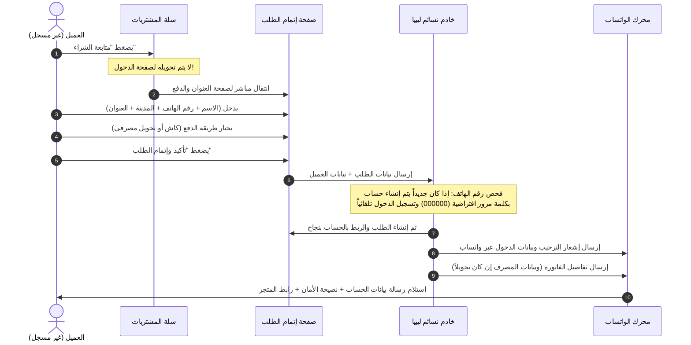

# خطة الشراء بدون تسجيل مسبق، رسائل الواتساب، وإدارة الحسابات (Fixes Plan 03: Frictionless Checkout, WhatsApp Integration & Account Governance)

هذه الوثيقة تمثل الخطة الهندسية والتشغيلية المفصلة لتطبيق المتطلبات الجديدة:
1. **طرق الدفع المعتمدة (كاش أو تحويل مصرفي فقط)** مع ملاحظة التحويل البنكي ورسالة الواتساب الآلية التي تشمل (رقم الحساب، الآيبان، والفاتورة الكاملة).
2. **تنظيف قوائم اختيار المدن والمناطق** من عرض الأسعار والرسوم داخل القائمة (`remove all bills/fees from city select`).
3. **إتمام الشراء السلس بدون تسجيل مسبق (Frictionless / Guest Checkout)** مع إنشاء حساب آلي بكلمة مرور أصفار (`000000`) وإشعار العميل فورياً عبر الواتساب برابط المتجر مع نصحه بتغييرها.
4. **أدوات تحكم المدير في حسابات العملاء (User Account Control)** بما في ذلك تغيير كلمات المرور وتعديل البيانات.

---

## 1. طرق الدفع المعتمدة: كاش وتحويل مصرفي (Cash & Bank Transfer Architecture)

### خيارات الدفع في صفحة إتمام الطلب (`Checkout.tsx`):
يتم قصر خيارات الدفع على خيارين فقط:
1. **الدفع عند الاستلام كاش (COD)**:
   - العنوان: «الدفع عند الاستلام (كاش)»
   - الوصف: «سداد القيمة نقداً للمندوب بعد استلام ومعاينة العطر.»
2. **تحويل مصرفي مباشر (Bank Transfer)**:
   - العنوان: «تحويل مصرفي»
   - الملاحظة المرافقة الإلزامية:
     > «**سيتم التواصل معك تلقائياً عبر واتساب لتزويدك ببيانات الحساب المصرفي للتحويل.**»

### نظام إرسال بيانات الحساب المصرفي والفاتورة عبر واتساب:
عند تأكيد العميل للطلب باختيار «تحويل مصرفي»:
1. يقوم الباك إند بتسجيل الطلب بحالة `pending`.
2. يتم تجهيز وإرسال رسالة واتساب آلية منسقة للعميل على رقمه المسجل:
   - **الترويسة**: «مرحباً [اسم العميل]، شكراً لطلبك من متجر نسائم ليبيا للعطور الفاخرة 🌸»
   - **بيانات الحساب المصرفي المعتمد للمتجر**:
     - اسم المصرف: [مصرف الجمهورية / المصرف التجاري الوطني]
     - اسم صاحب الحساب: [شركة نسائم ليبيا لاستيراد العطور]
     - رقم الحساب المصرفي (Account No): `0123456789`
     - رقم الآيبان الدولي (IBAN): `LY88 0001 0123 4567 8901 2345`
   - **فاتورة وتفاصيل الطلب الكاملة**:
     - رقم الطلب: `#2026...`
     - المنتجات المطلوبة مع الكميات والأسعار الفردية.
     - رسوم التوصيل والخصومات إن وجدت.
     - **المبلغ الإجمالي المطلوب تحويله**.
   - **تعليمات التأكيد**: «يرجى إرسال صورة إشعار التحويل رداً على هذه الرسالة ليتم تأكيد طلبك والبدء في تجهيزه فوراً 🚚.»

---

## 2. تنظيف محدد المدن والمناطق (Clean City & Region Dropdowns)

### المشكلة الحالية:
تظهر المدن والمناطق في القوائم المنسدلة مصحوبة بأسعار التوصيل مدمجة في الاسم، مثل:
`طرابلس (15.00 د.ل)`، `بنغازي (25.00 د.ل)`، `حي الأندلس — توصيل 15.00 د.ل`.
وهذا يسبب تشويشاً بصرياً ويخل بتجربة اختيار المدينة السلسة.

### الحل والتنفيذ البرمجي:
1. **في `Checkout.tsx` و `QuickOrderModal.tsx` و `MyAddresses.tsx`**:
   - إزالة نصوص `({formatPrice(...)})` من وسم `<option>`.
   - عرض اسم المدينة الصافي فقط: `طرابلس`، `بنغازي`، `مصراتة`، `الزاوية`، `طبرق`، `سبها`...
   - عرض اسم الحي الصافي: `حي الأندلس`، `الظهرة`، `السياحية`...
2. **مكان عرض الرسوم**:
   - تُعرض رسوم التوصيل المحسوبة في مكانها الطبيعي المخصص: **«ملخص الطلب (Order Summary)»** في خانة «رسوم التوصيل»، دون إقحامها داخل أسماء المدن.

---

## 3. الشراء بدون تسجيل مسبق والتسجيل التلقائي (Frictionless Guest Checkout & Auto-Account)

### تدفق الشراء الجديد (Customer Journey):



### تفاصيل الحساب التلقائي ورسالة الأمان:
1. **إنشاء الحساب في الباك إند (`CartCheckoutView` / `services.checkout`)**:
   - فحص `phone_number`:
     - إذا كان العميل موجوداً مسبقاً: يتم ربط الطلب بحسابه وتحديث اسمه إن طرأ تغيير.
     - إذا كان عميلاً جديداً:
       - يتم إنشاء حساب مستخدم جديد:
         - `phone_number`: رقم هاتف العميل.
         - `name`: الاسم الذي أدخله في صفحة الطلب.
         - `password`: يتم ضبطه على أصفار (`000000`).
         - `role`: `CUSTOMER`.
       - يتم تسجيل دخول العميل فورياً في جلسة المتصفح (Session Login) ليتمكن من متابعة الطلب.
2. **رسالة الواتساب الترحيبية وتنبيه الأمان**:
   يتم إرسال رسالة واتساب للعميل تتضمن:
   ```text
   أهلاً بك يا [اسم العميل] في عائلة نسائم ليبيا للعطور الفاخرة! 🌟

   تم إنشاء حساب خاص بك في متجرنا لتتمكن من متابعة طلباتك ونقاط ولائك بسهولة:
   📱 رقم الهاتف: [رقم الهاتف]
   🔑 كلمة المرور المؤقتة: 000000

   ⚠️ نصيحة أمان مهمة:
   ننصحك بتسجيل الدخول إلى حسابك عبر الرابط أدناه وتغيير كلمة المرور الخاصة بك لحماية خصوصيتك وأمان حسابك.

   🔗 رابط المتجر وإدارة حسابك:
   https://nasaim.ly/profile
   ```

---

## 4. أدوات تحكم المدير في حسابات العملاء (Admin User Account Governance)

### المشكلة الحالية:
لوحة التحكم لا تحتوي على شاشة للمدير تمكنه من تغيير أو إعادة تعيين كلمة مرور العميل إذا طلب المساعدة، وتقتصر الإدارة على الحظر من الدفع عند الاستلام.

### التعديلات البرمجية المطلوبة:

#### أ. الباك إند (`backend/apps/accounts`):
1. **توسيع `AdminUserDetailView`**:
   - إضافة إمكانية تعيين كلمة مرور جديدة للمستخدم (`set_password`) عبر الـ API المخصص للمدراء (`IsAdminRole`).
   - دعم إعادة تعيين كلمة المرور إلى الأصفار الافتراضية بنقرة زر (`reset_to_default`).
   - إضافة إمكانية تعديل بيانات العميل الأساسية (الاسم، رقم الهاتف، البريد).
2. **إشعار العميل بالتغيير**:
   - توليد رابط واتساب مباشر للمدير لإرسال كلمة المرور الجديدة للعميل فور تعديلها.

#### ب. لوحة التحكم (`AdminUserDetail.tsx`):
1. **بطاقة التحكم في أمان وحساب العميل (Account Security & Credentials Card)**:
   - زر بارز: **«تغيير كلمة مرور العميل»** يفتح نافذة منبثقة (Modal) لإدخال كلمة مرور جديدة.
   - زر سريع: **«إعادة التعيين إلى كلمة المرور الافتراضية (000000)»** مع نافذة تأكيد.
   - زر: **«إرسال بيانات الدخول للعميل عبر واتساب»**.
2. **تعديل بيانات العميل الأساسية**:
   - إمكانية تعديل الاسم ورقم الهاتف وتحديث سجلاته مباشرة.

#### ج. واجهة العميل بالمتجر (`Profile.tsx` / `SecuritySettings.tsx`):
- إضافة قسم واضح في صفحة حساب العميل بعنوان **«أمان الحساب وكلمة المرور»**:
  - إدخال كلمة المرور الحالية (أو أصفار).
  - إدخال وتأكيد كلمة المرور الجديدة مع شريط قياس قوة كلمة المرور.
  - إظهار رسالة نجاح مع توجيه العميل.

---

## 5. مصفوفة الملفات المطلوب تعديلها لتنفيذ هذه الخطة

| المكون / الشاشة | الملف المستهدف | التعديل المطلوب |
| :--- | :--- | :--- |
| **سلة المشتريات** | `frontend/src/pages/storefront/Cart.tsx` | إلغاء شرط تسجيل الدخول الإلزامي (`navigate('/login')`) عند الضغط على متابعة الشراء، ونقل العميل مباشرة لإدخال العنوان. |
| **صفحة إتمام الطلب** | `frontend/src/pages/storefront/Checkout.tsx` | إضافة حقول الاسم والهاتف للزائر غير المسجل، قصر الدفع على (كاش أو تحويل مصرفي)، عرض ملاحظة الواتساب للتحويل، وتنظيف أسماء المدن من الرسوم. |
| **خدمات الباك إند** | `backend/apps/orders/services.py` & `views.py` | السماح بالشراء لغير المسجلين، إنشاء الحساب تلقائياً بكلمة مرور `000000`، وتسجيل دخول الجلسة. |
| **محرك الإشعارات والواتساب** | `backend/apps/orders/notifications.py` | دمج قوالب رسائل الواتساب: (1) فاتورة الطلب وبيانات الحساب والآيبان للتحويل، (2) إشعار إنشاء الحساب وبيانات الدخول ونصيحة الأمان. |
| **لوحة تحكم المستخدمين** | `backend/apps/accounts/views.py` & `AdminUserDetail.tsx` | إضافة زر ووظيفة تغيير وإعادة تعيين كلمة مرور العميل من قبل المدير. |
| **صفحة حساب العميل** | `frontend/src/pages/storefront/Profile.tsx` | تمكين العميل من تغيير كلمة مروره بسهولة. |
