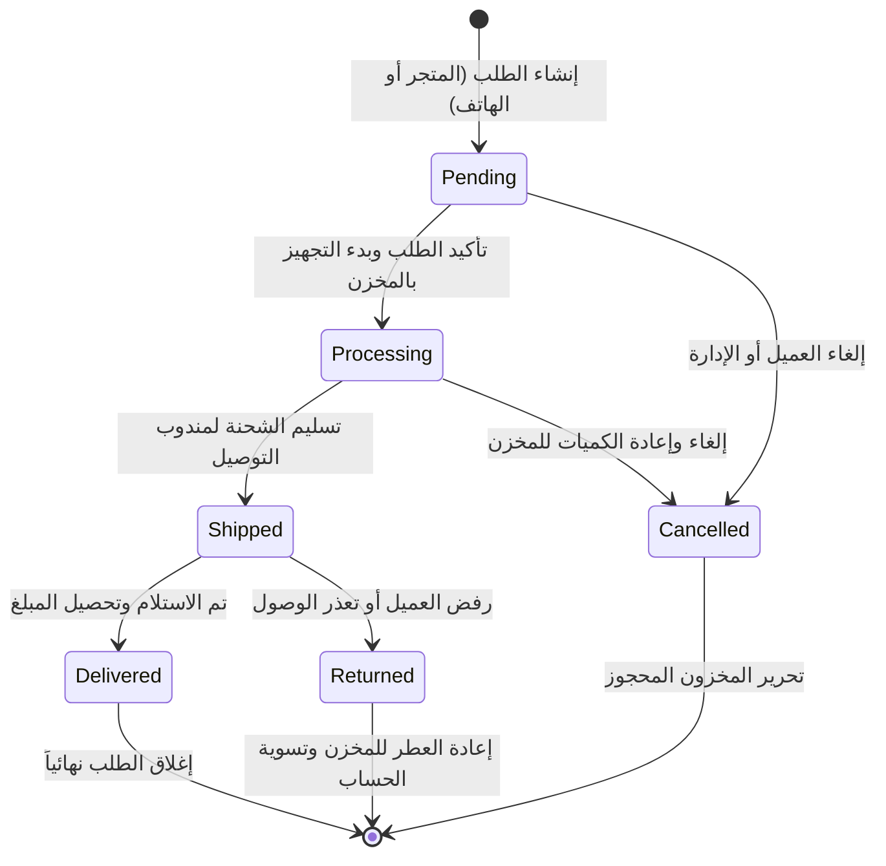

# 01 — الكفاءة التشغيلية وإدارة الطلبات السريعة
## 01 — Operational Velocity & Order Management Suite

> [!NOTE]
> **حالة التنفيذ في خط الإنتاج الأساسي (Current Production Baseline — 100% Complete & Verified)**:
> تم إنجاز واختبار كافة مكونات هذه الخطة بالكامل:
> 1. **الباكيند**: دوال وسيرفس `quick_create_admin_order` و `execute_bulk_order_action` مع نقاط النهاية `/api/admin/orders/quick-create/` و `/api/admin/customers/lookup/` و `/api/admin/orders/bulk-action/` واختبارات بايتست الشاملة (75/75 في orders و 283/283 عامة).
> 2. **الفرونت إند**: نافذة `QuickOrderModal.tsx` بدعم البحث الذكي بالهاتف ومربعات البحث السريع مع التوافق التام مع اختصار `Cmd+Shift+O`، وشريط العمليات الجماعية `bulkActions` في `AdminOrders.tsx`.
> 3. **الاختبارات الآلية الشاملة**: مرور 12/12 فحصاً معمارياً (Gates) و 72/72 اختبار Playwright E2E بنجاح تام.

---

## 🎯 الأهداف التشغيلية (Operational Goals)
1. **تجهيز وإدخال الطلبات الهاتفية والواتساب في أقل من 30 ثانية** دون الحاجة للمرور بسلة المتجر التقليدية.
2. **تنفيذ العمليات الجماعية على مئات الطلبات بنقرة واحدة** (تغيير الحالة، إرسال للمستودع، والطباعة).
3. **ضبط دورة حياة الطلب وحماية المخزون من التعارض أو التسريب**.

---

## 🏗️ 1. نافذة إنشاء الطلبات السريعة (Manual Quick Order Entry Modal)

### أ. سيناريو الاستخدام الواقعي (Real-World Use Case):
يتصل عميل هاتفياً أو يرسل رسالة عبر الواتساب: *«أريد عطر أرمسترونغ 100 مل وعطر رويال عود، التوصيل لطرابلس شارع النصر»*.
* **الوضع السابق**: كان الموظف يضطر للدخول كعميل وإنشاء حساب وسلة وعمل طلب يستغرق 3-5 دقائق!
* **الوضع الجديد مع نافذة الطلب السريع**: إدخال الطلب وحجز المخزون وإصدار الفاتورة في **25 ثانية فقط**.

```
┌─────────────────────────────────────────────────────────────────────────────────┐
│                     إنشاء طلب جديد يدوي (مبيعات الهاتف / الواتساب)                │
├─────────────────────────────────────────────────────────────────────────────────┤
│  📱 رقم هاتف العميل: [ 0912345678 ] ──> (جلب تلقائي: أحمد الفرجاني - طرابلس)     │
│  👤 اسم العميل:      [ أحمد الفرجاني      ]   📧 البريد: [ اختياري             ] │
│  📍 المدينة:         [ طرابلس           ▼ ]   🏙️ الحي:  [ شارع النصر          ] │
├─────────────────────────────────────────────────────────────────────────────────┤
│  🔍 البحث عن المنتجات: [ اكتب اسم العطر أو الباركود...                        ] │
│                                                                                 │
│  [ صورة ] عطر أرمسترونغ 100 مل   │ السعر: 220 د.ل │ الكمية: [ - 1 + ] │ [❌]   │
│  [ صورة ] عطر رويال عود 50 مل    │ السعر: 180 د.ل │ الكمية: [ - 1 + ] │ [❌]   │
├─────────────────────────────────────────────────────────────────────────────────┤
│  🏷️ كود الخصم / خصم يدوي: [            ] [ تطبيق ]                             │
│  🚚 شركة التوصيل المقترحة: [ فانكس للتوصيل السريع (15 د.ل)                  ▼ ] │
│  💳 طريقة الدفع:           [ الدفع عند الاستلام (COD)                       ▼ ] │
│  📝 ملاحظات التوصيل:       [ التسليم بعد الساعة 4 مساءً                      ] │
├─────────────────────────────────────────────────────────────────────────────────┤
│  المجموع الفرعي: 400.00 د.ل │ الشحن: 0.00 د.ل (عرض الشحن المجاني) │ الإجمالي: 400 د.ل │
│                                                                                 │
│         [ إلغاء ]                        [ ✅ حفظ وتأكيد الطلب فوراً (Enter) ]   │
└─────────────────────────────────────────────────────────────────────────────────┘
```

### ب. التفاصيل البرمجية والفنية (Technical Specs):
1. **الواجهة الخلفية (`Backend Endpoint`)**:
   - `POST /api/admin/orders/quick-create/`
   - الصلاحيات: `IsAdminRole` (أصحاب المتجر وموظفو إدارة المبيعات).
   - التحقق والعمليات:
     - فحص رقم الهاتف: إذا وجد مستخدم سابق يتم ربطه آلياً؛ إذا لم يوجد يتم إنشاء سجل عميل جديد برقم الهاتف وكلمة مرور عشوائية مؤمنة.
     - قفل صفوف المتغيرات العطرية `select_for_update` للتأكد من توفر الكمية بالمخزن وخصمها فورياً.
     - تطبيق محرك حسابات الخصومات والشحن المجاني التلقائي (`CartPromotion`).
     - توليد رقم طلب تسلسلي فريد: `#202608MANXXXX`.
2. **الواجهة الأمامية (`Frontend Component`)**:
   - مكون `QuickOrderDialog.tsx` قابل للفتح بزر رئيسي عائم واختصار لوحة مفاتيح (`Ctrl+Shift+O` / `Cmd+Shift+O`).
   - استعلام لحظي `useCustomerLookup(phone)` مع Debounce (300ms) للملء التلقائي.
   - قائمة سريعة `ProductCombobox` تتيح التنقل بالأسهم واختيار العطر بـ `Enter`.

---

## ⚡ 2. العمليات الجماعية على الطلبات (Bulk Order Operations)

### أ. الميزات في جدول الطلبات (`/admin/orders`):
1. **صندوق اختيار متعدد (`Checkbox`)** في رأس الجدول لتحديد كافة الطلبات الظاهرة أو طلبات معينة.
2. **شريط الأوامر الجماعية العائم (`Bulk Action Toolbar`)**:
   - **تغيير الحالة المجمعة (`Change Status`)**: تحويل 50 طلباً من `Pending` إلى `Processing` أو `Shipped` بنقرة واحدة.
   - **الطباعة المجمعة للبوالص (`Batch Print Waybills`)**: طباعة ملف PDF مجمع يحتوي على كافة بوالص الشحن الحرارية للطلبات المحددة بدون فتح كل طلب منفرداً.
   - **الطباعة المجمعة للفواتير (`Batch Print Invoices`)**: طباعة فواتير A4 المجمعة.
   - **الترحيل الجماعي لشركة الشحن (`Batch Dispatch to Courier`)**: إرسال كافة الطلبات المحددة لواجهة برمجة شركة التوصيل (Vanex/Nawres).
   - **التصدير المتقدم لإكسل (`Export Selected to Excel/CSV`)**: تصدير كشوفات منظمة لمسؤولي التجهيز والمحاسبة.

---

## 🔄 3. دورة حياة الطلب وحركات التدقيق (Order Lifecycle & Audit Trail)



### أ. سجل التدقيق الزمني لكل طلب (Order Audit Timeline):
- تسجيل كل حركة تجري على الطلب في جدول `OrderEvent`:
  - الوقت والتاريخ بالثانية.
  - الموظف المسؤول الذي أجرى التعديل.
  - الحالة السابقة والحالة الجديدة.
  - ملاحظة التغيير (مثال: *«تم تأكيد العنوان مع العميل هاتفياً وتم الترحيل لشركة فانكس»*).
