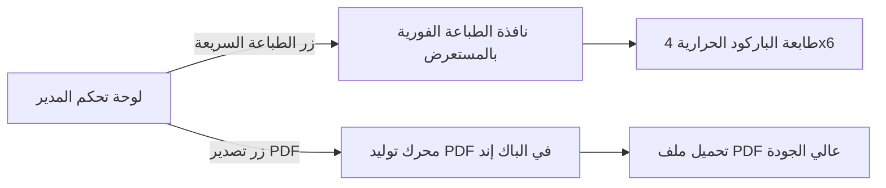

# 02 — بوالص الشحن الحرارية والفواتير الرسمية
## 02 — Thermal Waybills & Official Invoicing Suite

> **حالة التنفيذ**: مكتمل 100% ومفحوص بالكامل (100% Fully Implemented & Verified Baseline).
> **الاختبارات**: 287/287 Backend Pytest Green | 73/73 Playwright E2E Green | 17/17 Vitest Green | 12/12 Architectural Gates Green | WCAG 2.1 AA Compliant.

---

## 🎯 الأهداف التشغيلية (Operational Goals)
1. **طباعة ملصقات الشحن الحرارية بضغطة زر واحدة (4x6 إنش / 80 ملم)** متوافقة مع جميع طابعات الباركود الحرارية (Zebra, Xprinter, TSC, Dymo).
2. **إصدار فواتير رسمية A4 احترافية** بصيغة PDF تتضمن رمز استجابة سريعة (QR Code) وختم الضمان الأصلي للعطور.
3. **توفير خيار إخفاء الأسعار في بوالص الإهداء والهدايا الملكية**.

---

## 🏷️ 1. تصميم بوليصة الشحن الحرارية (Thermal Waybill 4x6 / 100x150mm)

```
┌─────────────────────────────────────────────────────────────────┐
│  نسائم ليبيا — عطور فاخرة وأصلية             [ شركة التوصيل: فانكس ]  │
│  NASAEEM LIBYA LUXURY PERFUMES             VANEX EXPRESS COURIER │
├─────────────────────────────────────────────────────────────────┤
│                                                                 │
│       |||||||||||||||||||||||||||||||||||||||||||||||||         │
│                     * 202608NL49821 *                           │
│                 رقم الشحنة: NL-TRIP-49821                        │
├─────────────────────────────────────────────────────────────────┤
│ 👤 المستلم:  أحمد الفرجاني                                      │
│ 📱 الهاتف 1: 091-2345678       📱 الهاتف 2: 092-8765432         │
│ 📍 الوجهة:   طرابلس — حي الأندلس / بجوار مدرسة الأمل           │
├─────────────────────────────────────────────────────────────────┤
│ 💰 المبلغ المطلوب تحصيله (COD):                                 │
│ ┌─────────────────────────────────────────────────────────────┐ │
│ │                  420.00 د.ل (كاش عند الاستلام)              │ │
│ └─────────────────────────────────────────────────────────────┘ │
├─────────────────────────────────────────────────────────────────┤
│ 📦 محتويات الطرد (Packing List):                                │
│ • 1x عطر أرمسترونغ رويال إديشن - 100 مل                         │
│ • 1x عطر استيارا ستاغ وايت - 100 مل                             │
├─────────────────────────────────────────────────────────────────┤
│ ⚠️ تنبيه: بضاعة قابلة للكسر (عطور زجاجية فاخرة) 🍷 | يُرجى الحذر  │
│ 📅 تاريخ الإصدار: 2026/08/23 │ 🕒 04:30 م │ طرد رقم: 1 من 1      │
└─────────────────────────────────────────────────────────────────┘
```

### أ. المميزات التقنية للبوليصة الحرارية:
* **تنسيق الطباعة المباشر (`CSS @media print`)**:
  - كود CSS مخصص بقياسات دقيقة: `@page { size: 100mm 150mm; margin: 0; }` و `@page { size: 80mm auto; margin: 0; }`.
  - نصوص واضحة باللون الأسود النقي على الخلفية البيضاء مع باركود عالي الدقة بصيغة `Code 128`.
* **دعم بوالص الهدايا (Gift Shipping Mode)**:
  - إذا كان الطلب موسوماً كـ «هدية»: يتم استبدال خانة المبلغ بـ `[ تم الدفع إلكترونياً بالكامل - لا يُحصّل أي مبلغ من المستلم ]` مع إخفاء أسعار العطور الفردية.

---

## 🧾 2. الفاتورة الرسمية A4 للعملاء والشركات (Official A4 Tax/Sales Invoice)

### أ. عناصر الفاتورة الرسمية:
1. **الترويسة الرسمية (Header)**:
   - شعار نسائم ليبيا عالي الدقة.
   - السجل التجاري، الرقم الضريبي (إن وجد)، رقم هاتف خدمة العملاء، والعنوان في طرابلس/ليبيا.
   - رقم الفاتورة التسلسلي الرسمي (`INV-2026-08-0145`) وتاريخ ووقت الإصدار.
2. **جدول تفاصيل المنتجات والأسعار**:
   - اسم العطر، الماركة، الحجم (مل).
   - سعر الوحدة، الكمية، الإجمالي قبل الخصم، قيمة الخصم المطبقة، وصافي السعر.
3. **ملخص المبالغ المالية**:
   - المجموع الفرعي للمنتجات.
   - خصم العروض والكوبونات.
   - رسوم التوصيل (أو وسام شحن مجاني أخضر).
   - **المبلغ الإجمالي الصافي بالدينار الليبي (رقماً وكتابةً: فقط أربعمائة وعشرون ديناراً لا غير)**.
4. **التأمين والضمان العطري**:
   - رمز استجابة سريعة (QR Code) مشفر للتحقق من أصالة الفاتورة والطلب عبر الإنترنت.
   - ختم الضمان: *«نسائم ليبيا تضمن أصالة كافة العطور بنسبة 100%»*.
   - شروط الاستبدال والاسترجاع (خلال 7 أيام في حال عدم فتح التغليف الأصلي).

---

## 🛠️ 3. التنفيذ البرمجي ومسارات العمل (Implementation Workflow)



### أ. نقاط النهاية البرمجية (API Endpoints):
- `GET /api/admin/orders/<order_id>/waybill/` — إرجاع كود HTML/CSS الجاهز للطباعة الحرارية المباشرة.
- `GET /api/admin/orders/<order_id>/invoice/pdf/` — توليد وتنزيل ملف الفاتورة الرسمي بصيغة PDF.
- `POST /api/admin/orders/batch-waybills/` — استقبال قائمة معرّفات الطلبات وتوليد ملف مجمع للطباعة المتتالية لـ 50 بوليصة في ثوانٍ معدودة.
