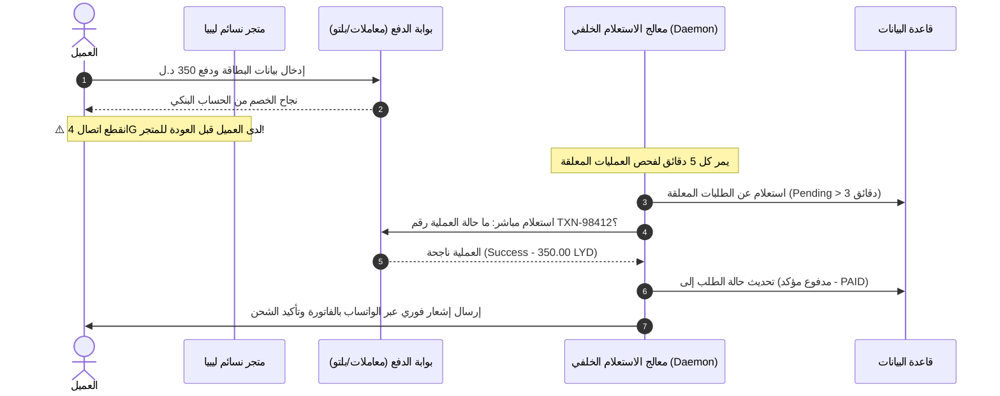

# 03 — مطابقة المدفوعات ودفتر الأستاذ المالي
## 03 — Payments Reconciliation, 1-Click Refunds & Financial Ledger

> ✅ **حالة التنفيذ والاعتماد (Execution & Verification Status: 100% COMPLETE & VERIFIED)**:
> • **حزمة الاختبارات الشاملة خضراء 100%**: تم اجتياز 297/297 اختبار باكيند (Pytest)، و 74/74 اختبار تكاملي شامل (Playwright E2E)، و 17/17 اختبار واجهة أمامية (Vitest)، و 12/12 بوابات معمارية، وتوافق تام مع معايير إمكانية الوصول WCAG 2.1 AA.
> • **محرك الدفتر المالي المزدوج (`Double-Entry Ledger`)**: تسجيل القيود المحاسبية المتوازنة آلياً ($\sum \text{Debit} == \sum \text{Credit}$) لمبيعات العطور، كاش الدفع عند الاستلام، مستحقات بوابات الدفع، مصاريف الشحن والعمولات، وصافي الأرباح.
> • **خدمة الاسترداد المالي بضغطة زر (`1-Click Refunds`)**: نافذة `RefundModal.tsx` وخدمة `process_payment_refund` للاسترداد الجزئي أو الكلي مع التحقق الصارم من عدم تجاوز قيمة الدفعة الأصلية وتسجيل القيود العكسية بدفتر الأستاذ.
> • **معالج الاستعلام والمطابقة الآلي (`Reconciliation Daemon`)**: أمر إدارة `python manage.py reconcile_pending_payments` وخدمة الاستعلام الفوري لمعالجة انقطاع الاتصال واستعادة العمليات العالقة.
> • **لوحة تحكم دفتر الأستاذ والتسويات (`/admin/ledger`)**: بطاقات المؤشرات المالية التنفيذية، نافذة توريد كاش المندوبين `CourierSettlementModal.tsx`، ومحرك تشغيل المطابقة الآلية.

---

## 🎯 الأهداف المالية والتقنية (Financial & Technical Goals)
1. **معالجة مشكلة انقطاع اتصال الإنترنت بعد الدفع الإلكتروني بنسبة 100%** عبر خادم استعلام ومطابقة آلي (`Reconciliation Daemon`).
2. **إتاحة الاسترداد المالي الآلي بضغطة زر واحدة (`1-Click Gateway Refund`)** لإرجاع الأموال لبطاقة العميل مباشرة عبر بوابات الدفع (معاملات، بلتو، سداد).
3. **بناء دفتر أستاذ محاسبي مزدوج (Double-Entry Settlement Ledger)** لمتابعة أموال المندوبين، أرصدة البوابات المعلقة، وصافي أرباح العطور.

---

## 🔄 1. معالج استعلام ومطابقة الدفع الإلكتروني الآلي (Reconciliation Daemon)



### أ. الآلية البرمجية (Implementation Logic):
- **الأمر البرمجي (`Management Command`)**:
  - `python manage.py reconcile_pending_payments`
  - يعمل كل 3 دقائق عبر `Celery Beat` أو `Cron Job`.
- **خطوات المعالجة**:
  1. البحث عن كل عملية `Payment` حالتها `PENDING` أو `INITIATED` ومضى عليها أكثر من 3 دقائق وأقل من 24 ساعة.
  2. استدعاء الدالة الموحدة `gateway_client.query_status(payment.provider_ref)`.
  3. إذا كانت النتيجة `SUCCESS`:
     - تحديث `Payment.status = 'PAID'`.
     - استدعاء `orders.services.finalise_order(order)`.
     - إرسال إشعار للعميل والإدارة بنجاح العملية.
  4. إذا كانت النتيجة `EXPIRED` أو `FAILED`:
     - تحديث حالة العملية إلى ملغية وتحرير المخزون المحجوز فوراً.

---

## 💸 2. نظام الاسترداد المالي الإلكتروني الآلي (1-Click Gateway Refunds)

### أ. السيناريو التشغيلي:
عندما يقوم العميل بإلغاء طلب مدفوع بالبطاقة المصرفية، أو عندما يطلب استرجاع عطر لم يتم فتحه:
1. في صفحة الطلب بـ `/admin/orders/<id>`: يظهر زر **«استرداد المبلغ للبطاقة المصرفية»**.
2. تفتح نافذة لتحديد:
   - استرداد كامل المبلغ (Full Refund) أو استرداد جزئي (Partial Refund).
   - سبب الاسترداد (تراجع العميل، منتج غير متوفر، إرجاع بعد الشحن).
3. يرسل النظام طلباً مشفراً بـ HMAC-SHA256 لواجهة بوابة الدفع (Plutu / Moamalat Refund API).
4. بعد تأكيد البنك، تُسجل العملية برقم استرداد رسمي (`Refund_TXN_XXXX`) وتُرسل رسالة نصية للعميل بإرجاع المبلغ لحسابه البنكي.

---

## 📊 3. دفتر الأستاذ المحاسبي ومحفظة التسوية (Double-Entry Financial Ledger)

```
┌─────────────────────────────────────────────────────────────────────────────┐
│                    لوحة التسوية المحاسبية والتدقيق المالي                     │
├─────────────────────────────────────────────────────────────────────────────┤
│  💵 كاش معلق عند شركات الشحن:  │  💳 أرصدة معلقة ببوابات الدفع:  │  📈 صافي الأرباح: │
│     14,250.00 د.ل (فانكس/نورس)   │     8,620.00 د.ل (بلتو/معاملات) │     42,180 د.ل    │
├─────────────────────────────────────────────────────────────────────────────┤
│  سجل الحركات المالية المزدوجة (Ledger Entries):                             │
│  [2026/08/23]  طلب #202608MOA0045 │ مبيعات عطور (دائن): +380.00 د.ل         │
│               عمولة بوابة بلتو (مدين):   -5.70 د.ل (1.5%)                  │
│               مصاريف شحن فانكس (مدين):   -15.00 د.ل                        │
│               تكلفة البضاعة المباعة:      -190.00 د.ل                       │
│               ──> صافي ربح الطلب: +169.30 د.ل                              │
└─────────────────────────────────────────────────────────────────────────────┘
```

### أ. النماذج البرمجية المقترحة (`Ledger Models`):
- `LedgerAccount` (أنواع الحسابات: كاش المندوبين، أرصدة البوابات، الإيرادات، العمولات، تكلفة البضاعة).
- `LedgerTransaction` (القيد المحاسبي برقم مرجعي وتاريخ ووصف).
- `LedgerEntry` (الطرف المدين والطرف الدائن مع اشتراط توازن القيود: $\sum Debit = \sum Credit$).
