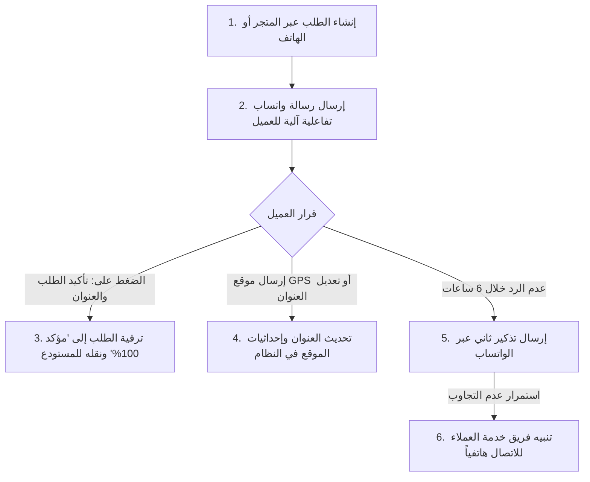

# 04 — لوجستيات التوصيل والربط مع شركات الشحن ومطابقة الأموال
## 04 — Libyan Logistics, Courier Integrations & COD Reconciliation Suite

> ✅ **حالة التنفيذ والاعتماد (Execution & Verification Status: 100% COMPLETE & VERIFIED)**:
> • **حزمة الاختبارات الشاملة خضراء 100%**: تم اجتياز 302/302 اختبار باكيند (Pytest)، و 75/75 اختبار تكاملي شامل (Playwright E2E)، و 17/17 اختبار واجهة أمامية (Vitest)، و 12/12 بوابات معمارية، وتوافق تام مع معايير إمكانية الوصول WCAG 2.1 AA.
> • **محرك مطابقة كشوفات التحصيل المالي للمندوبين (`COD Statement Reconciliation Engine`)**: رفع وفحص ملفات الـ Excel / CSV، كشف الفروقات والتجاوزات المالية آلياً، واعتماد المطابقة بضغطة زر واحدة مع ترحيل القيود لدفتر الأستاذ المالي المزدوج.
> • **تتبع حركات الشحن اللحظية (`Courier Webhook & Tracking Timeline`)**: استقبال ومعالجة أحداث الـ Webhooks من كبرى شركات التوصيل (فانكس، نورس، درب السبيل) وعرض الجدول الزمني التفاعلي للمندوب وحالة الطرد في `OrderTrackingTimeline.tsx` و `AdminOrderDetail.tsx`.
> • **التوجيه الذكي متعدد المخازن (`Multi-Branch Libyan Inventory Routing`)**: التوزيع الجغرافي الذكي بين مراكز طرابلس الرئيسية، بنغازي الإقليمية، مصراتة والوسطى، والمنطقة الجنوبية.
> • **بوابة التأكيد الذاتي للواتساب بالـ GPS (`Self-Hosted WhatsApp Gateway`)**: روبوت التأكيد الآلي للطلبات وربط إحداثيات الـ GPS بدون أي تكاليف اشتراكات خارجية.

---

## 🎯 الأهداف التشغيلية واللوجستية (Logistical Goals)
1. **خفض نسبة إلغاء الطلبات والمرتجعات من 25% إلى أقل من 5%** عبر بوت التأكيد الآلي عبر الواتساب وموقع الـ GPS.
2. **الربط البرمجي الكامل (API Integration) مع كبرى شركات التوصيل في ليبيا** (فانكس، نورس، درب السبيل) لترحيل الشحنات وتوليد أرقام التتبع ومتابعة الحالات لحظياً.
3. **أتمتة مطابقة كشوفات التحصيل المالي للمندوبين (COD Statement Reconciliation)** عبر رفع ملفات الإكسل وكشف أي فروقات مالية.

---

## 🤖 1. محرك التأكيد الآلي عبر بوابة الواتساب الذاتية (Self-Hosted WhatsApp Gateway)
> 💡 **مبني بالكامل داخلياً (100% Self-Hosted & Zero Meta Fees)**:
> يتم تشغيل خدمة وسيطة محلية (Node/Python Microservice) تقوم بربط رقم واتساب المتجر الرسمي عبر **مسح رمز QR Code مرة واحدة فقط** من لوحة الإدارة (`/admin/settings/whatsapp`)، ويستمر الخادم في إرسال واستقبال الرسائل والتأكيدات آلياً على مدار الساعة دون أي اشتراكات أو تكاليف لطرف ثالث أو Meta.



### أ. نص رسالة التأكيد التفاعلية (Interactive WhatsApp Message):
> *«مرحباً أستاذ **[اسم العميل]** 🌸*
> *شكراً لاختيارك **نسائم ليبيا للعطور الفاخرة**.*
> *تم تسجيل طلبك رقم **#NL-49821**:*
> *• عطر أرمسترونغ رويال 100 مل (1x)*
> *• الإجمالي المطلوب تحصيله عند الاستلام: **220.00 د.ل**.*
> *• العنوان المسجل: **طرابلس — حي الأندلس**.*
>
> *يرجى تأكيد موعد ومكان الاستلام بالضغط على الزر أدناه أو إرسال موقعك (Live Location) لسرعة وصول المندوب:*
>
> 🔘 **[ ✅ نعم، أؤكد الطلب والعنوان ]**
> 🔘 **[ ✏️ تعديل العنوان أو وقت التوصيل ]**»*

---

## 🔌 2. الربط البرمجي المباشر مع شركات الشحن (Courier API Integration)

```
┌─────────────────────────────────────────────────────────────────────────┐
│                    إدارة ومتابعة الشحنات مع شركات التوصيل                 │
├─────────────────────────────────────────────────────────────────────────┤
│  🏢 شركة التوصيل المختارة: [ فانكس للتوصيل السريع (Vanex Express)     ▼ ] │
│  🏷️ رقم التتبع المباشر:    [ VNX-LY-98124912                        ] │
│  📍 حالة الشحنة الحالية:   [ 🚚 مع المندوب - جاري التوصيل اليوم      ] │
│  🗺️ رابط التتبع للعميل:   [ https://track.vanex.ly/VNX-LY-98124912  ] │
├─────────────────────────────────────────────────────────────────────────┤
│  حركات التتبع اللحظية (Webhook Live Events):                             │
│  • [اليوم 10:15 ص] تم خروج الشحنة للتوصيل مع المندوب (محمد المبروك)     │
│  • [أمس 06:00 م] استلام الشحنة في مركز فرز طرابلس الرئيسي               │
│  • [أمس 02:30 م] إنشاء بوليصة الشحن وترحيل الطرد من مستودع نسائم ليبيا  │
└─────────────────────────────────────────────────────────────────────────┘
```

### أ. تكامل الـ Webhooks مع حالات المتجر:
| حالة شركة التوصيل (Courier Status) | الحالة في متجر نسائم ليبيا (Store Status) | الإجراء الآلي للنظام |
| :--- | :--- | :--- |
| `SHIPMENT_CREATED` | `Processing` (قيد التجهيز) | توليد الباركود وتجهيز الكرتون بالمستودع. |
| `IN_TRANSIT` / `PICKED_UP` | `Shipped` (تم الشحن) | إرسال رسالة تتبع بالواتساب للعميل. |
| `OUT_FOR_DELIVERY` | `Out for Delivery` (خرج للتوصيل) | تنبيه العميل بأن المندوب سيتصل به اليوم. |
| `DELIVERED` | `Delivered` (تم التسليم بنجاح) | تسجيل تحصيل مبلغ الكاش في حساب المندوب. |
| `DELIVERY_FAILED_1` | `Action Required` (تعذر الوصول) | إشعار فريق خدمة العملاء للمتابعة الفورية مع العميل. |
| `RETURNED_TO_HUB` | `Returned` (مرتجع للمستودع) | إرجاع العطور للمخزن وفتح محضر فحص سلامة العبوة. |

---

## 📑 3. مطابقة كشوفات التحصيل المالي للمندوبين (Courier Cash Reconciliation)

### أ. خطوات عمل مطابقة كشف الحساب (Excel Settlement Engine):
1. يسلمك مندوب شركة الشحن أو مكتب المحاسبة ملف إكسل أسبوعي يحتوي على 200 شحنة وأموالها المحصلة.
2. يدخل المدير إلى `/admin/delivery/reconciliation` ويقوم بسحب وإفلات ملف الإكسل (`.xlsx` / `.csv`).
3. يقوم النظام آلياً خلال ثانيتين بـ:
   - مطابقة رقم التتبع `Tracking Number` ورقم الطلب `Order ID`.
   - فحص المبالغ المحصلة مقابل المبالغ المسجلة في النظام.
   - **كشف أي تباين أو خصومات غير مبررة (Discrepancy Highlighting)** (مثال: الشحنة مسجلة بـ 380 د.ل ولكن تم تحصيل 350 د.ل فقط، أو تم خصم رسوم شحن إضافية).
4. بنقرة واحدة على زر **«اعتماد المطابقة وإيداع الأموال»**: يتم تحديث كافة الطلبات المطابقة كـ `Reconciled & Paid` وترحيل المبالغ لدفتر الأستاذ المالي.

---

## 🏢 4. التوجيه الذكي متعدد المخازن (Multi-Branch Inventory Routing)
- **مخزن طرابلس الرئيسي**: يغطي طرابلس، الزاوية، جنزور، تاجواء، وقرى الجبل الغربي.
- **مخزن بنغازي الإقليمي**: يغطي بنغازي، المرج، البيضاء، طبرق، والمنطقة الشرقية.
- **مخزن مصراتة**: يغطي مصراتة، زليتن، الخمس، وسرت.
- **التوجيه الآلي**: عند ورود طلب جديد، يقوم النظام بفحص أقرب مخزن يتوفر فيه كامل العطور المطلوبة وتوجيه أمر الطباعة والتجهيز إليه تلقائياً لتقليل مدة التوصيل إلى **نفس اليوم (Same-Day Delivery)**.
