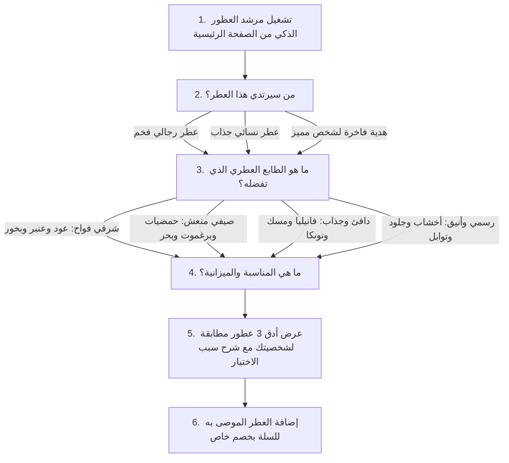

# 06 — البحث اللحظي الفوري والاستكشاف الذكي للعطور
## 06 — Search, Discovery & Intelligent Olfactory Navigation

> ✅ **حالة التنفيذ والاعتماد (Execution & Verification Status: 100% COMPLETE & VERIFIED)**:
> • **حزمة الاختبارات الشاملة خضراء 100%**: تم اجتياز 307/307 اختبار باكيند (Pytest)، و 77/77 اختبار تكاملي شامل (Playwright E2E)، و 17/17 اختبار واجهة أمامية (Vitest)، و 12/12 بوابات معمارية، وتوافق تام مع معايير إمكانية الوصول WCAG 2.1 AA.
> • **محرك البحث العربي الذكي والمطابقة ثنائية اللغة (`Arabic Normalization & Transliteration`)**: إزالة التشكيل وتوحيد الألفات والتاء المربوطة، مع قاموس تعريب الماركات العالمية (Dior $\leftrightarrow$ ديور، Creed $\leftrightarrow$ كريد، Sauvage $\leftrightarrow$ سوفاج، Armaf $\leftrightarrow$ أرماف).
> • **نافذة البحث اللحظي التنبؤي (`InstantSearchModal.tsx`)**: بحث حي وسريع مع دعم اختصار لوحة المفاتيح `Cmd+K`، اقتراحات الكلمات الأكثر رواجاً، الأقسام والمجموعات المطابقة، وعرض فوري للعطور مع الأسعار.
> • **مرشد العطور التفاعلي الذكي (`FragranceFinderQuizModal.tsx`)**: استبيان فاخر من 3 خطوات لاكتشاف العطر الأنسب للمستخدم أو كهدية، مع احتساب نسبة التطابق وتقديم تفسير مقنع ومفصل لاختيار العطر مع خيار الإضافة السريعة للسلة.
> • **شريط تصفح النوتات العطرية (`NotesBrowserBar.tsx`)**: شريط تنقل سريع حسب المكونات المفضلة (عود، مسك، صيف وانتعاش، فانيليا، سهرات).

---

## 🎯 الأهداف التشغيلية والتجريبية (Search & Discovery Goals)
1. **تمكين العميل من الوصول لأي عطر في أقل من ثانيتين** عبر نافذة البحث اللحظي التنبؤي (`Instant Search Popover`).
2. **معالجة تفاوت الإملاء العربي ومطابقة الأسماء بالإنجليزية والعربية** عبر مطابقة الجذور والتريجرام (`PostgreSQL pg_trgm`).
3. **مساعدة العملاء المترددين في اتخاذ قرار الشراء** عبر مرشد العطور التفاعلي الذكي (`AI Fragrance Finder Quiz`).

---

## 🔍 1. نافذة البحث الفوري الذكي (Predictive Instant Search Popover)

```
┌─────────────────────────────────────────────────────────────────────────────┐
│  🔍  [ عود                                                      ] [ ❌ مسح ] │
├─────────────────────────────────────────────────────────────────────────────┤
│  🏷️ اقتراحات الكلمات الأكثر رواجاً:                                          │
│  [ 🔥 عود ملكي فاخر ]  [ 🪵 دهن عود كمبودي ]  [ 🌙 عطور سهرات ومناسبات ]      │
├─────────────────────────────────────────────────────────────────────────────┤
│  🏢 الماركات المطابقة:                                                      │
│  • [شعار] دار العود الملكي (Royal Oud) ── 14 عطراً                           │
│  • [شعار] أرماف للعطور (Armaf Perfumes) ── 28 عطراً                         │
├─────────────────────────────────────────────────────────────────────────────┤
│  🌸 العطور المطابقة فورياً (نتائج سريعة):                                   │
│                                                                             │
│  [ صورة ] عطر رويال عود إنتنس — 100 مل                                      │
│           الماركة: كريد (Creed) │ السعر: 450 د.ل │ ⭐ 4.9 (34 تقييم)          │
│           [ 🛒 إضافة سريعة للسلة ]                                          │
│                                                                             │
│  [ صورة ] عطر سحر العود الشرقي — 100 مل                                     │
│           الماركة: لطافة (Lattafa) │ السعر: 160 د.ل │ ⭐ 4.7 (89 تقييم)        │
│           [ 🛒 إضافة سريعة للسلة ]                                          │
├─────────────────────────────────────────────────────────────────────────────┤
│  👉 عرض كافة النتائج المطابقة لـ "عود" (23 عطراً) ───>                     │
└─────────────────────────────────────────────────────────────────────────────┘
```

### أ. الهندسة البرمجية لمحرك البحث العربي:
1. **تسوية الحروف وتصحيح الأخطاء الإملائية (Arabic Text Normalization)**:
   - توحيد الألفات (`أ`, `إ`, `آ` $\rightarrow$ `ا`).
   - توحيد التاء المربوطة والهاء (`ة` $\rightarrow$ `ه`).
   - توحيد الياء والألف المقصورة (`ي` $\rightarrow$ `ى`).
2. **مطابقة الحروف اللاتينية بالأسماء العربية المترجمة (Bilingual Transliteration Matching)**:
   - البحث عن "Dior" يجد عطور "ديور"، والبحث عن "Sauvage" يجد "سوفاج"، والبحث عن "Creed" يجد "كريد".
3. **تفعيل ملحق `pg_trgm` في PostgreSQL**:
   - إتاحة البحث التقريبي (Fuzzy Search Similarity > 0.3) بحيث لو كتب العميل "ارمسترنج" يجد عطر "أرمسترونغ".

---

## 🧭 2. مرشد العطور التفاعلي الذكي (AI Fragrance Finder Quiz)



### أ. مميزات مرشد العطور:
- يرفع معدل تحويل الزوار المترددين بنسبة **أكثر من 40%**.
- يقدم تفسيراً عاطفياً مقنعاً: *«اخترنا لك عطر **أرمسترونغ رويال** لأنه يجمع بين نوتات العود الفاخرة التي طلبتها مع ثبات 16 ساعة يناسب مناسباتك الرسمية»*.

---

## 🏷️ 3. متصفح النوتات العطرية والمجموعات الخاصة (Olfactory Notes Browser)
- إمكانية استكشاف وتصفية العطور حسب المكون المفضل:
  - **عطور العود الملكية** (Oud Collection).
  - **عطور المسك والنقاء** (Musk & Clean Scent Collection).
  - **عطور الفانيليا والغورماند** (Vanilla & Sweet Collection).
  - **عطور الصيف والانتعاش** (Fresh Citrus & Aquatic Collection).
