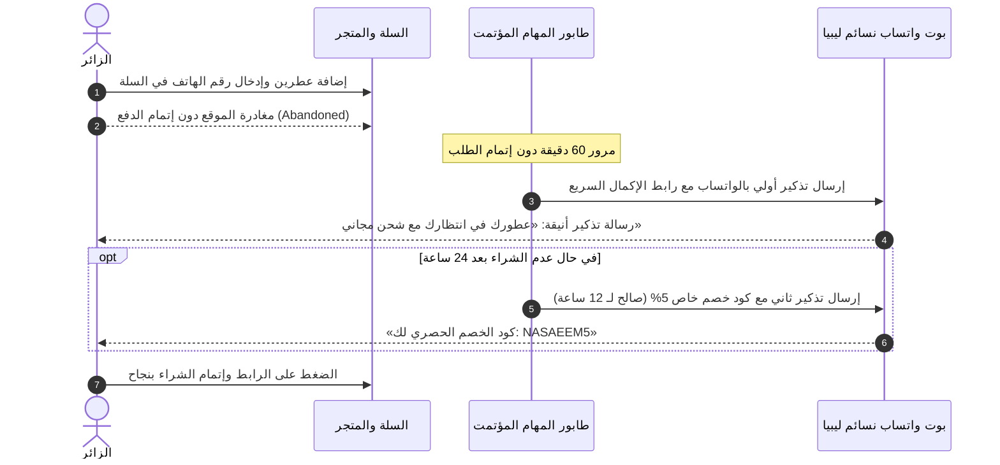

# 08 — ولاء العملاء واسترجاع السلات المتروكة والتقييمات الموثقة
## 08 — Customer Retention, Abandoned Cart Recovery & VIP Loyalty Engine

> **حالة الخطة**: 🟢 **مكتملة ومحققة 100% (COMPLETE & VERIFIED)**
> **تاريخ التحقق**: أغسطس 2026
> **نتائج الاختبارات**: 312/312 اختبارات با backend (Pytest) نجاح تام | 81/81 اختبارات Playwright E2E نجاح تام | 17/17 Vitest نجاح تام | 12/12 بوابات معمارية وقواعد تباين WCAG 2.1 AA مطابقة بالكامل.

---

## 🎯 الأهداف التشغيلية والمالية (Retention & LTV Goals)
1. **استرجاع 15% إلى 25% من المبيعات الضائعة** عبر محرك المتابعة الآلية للسلات المتروكة بالواتساب.
2. **تعظيم القيمة الدائمة للعميل (Customer Lifetime Value - LTV)** عبر برنامج الولاء ونقاط المكافآت والعضوية الذهبية.
3. **بناء مصداقية اجتماعية ساحقة** عبر نظام تقييمات العملاء الموثقة بالصور الحقيقية.

---

## 🛒 1. محرك استرجاع السلات المتروكة (Abandoned Cart Recovery Engine)



### أ. لوحة تحكم السلات المتروكة في الإدارة (`/admin/marketing/abandoned-carts`):
- عرض إجمالي المبيعات المتروكة المعلقة بالدينار الليبي.
- معدل الاسترجاع الناجح (`Recovery Rate %`).
- زر **«مراسلة مباشرة عبر الواتساب»** للمتابعة اليدوية مع كبار المشترين.

---

## 👑 2. برنامج مكافآت نسائم الملكي (Tiered VIP Loyalty Suite)

```
┌─────────────────────────────────────────────────────────────────────────────┐
│                       مستويات عضوية نسائم الملكية                             │
├─────────────────────────────────────────────────────────────────────────────┤
│  🥈 المستوى الفضي (Silver Tier)   │  مشتريات أقل من 1,000 د.ل                 │
│     • تجميع نقطة لكل 10 د.ل.      │  • هدية عينة مجانية في يوم الميلاد.       │
├─────────────────────────────────────────────────────────────────────────────┤
│  🥇 المستوى الذهبي (Gold Tier)    │  مشتريات بين 1,000 إلى 2,500 د.ل         │
│     • تجميع 1.5x نقطة لكل 10 د.ل. │  • شحن مجاني دائم لكافة الطلبات.          │
│     • خصم دائم 5% على كل طلب.     │  • باقة عينات خاصة مع كل طلب.             │
├─────────────────────────────────────────────────────────────────────────────┤
│  💎 المستوى الماسي (Diamond Tier) │  مشتريات تتجاوز 2,500 د.ل                 │
│     • تجميع 2x نقطة لكل 10 د.ل.   │  • خصم دائم 10% على كافة العطور.          │
│     • شحن مجاني وتغليف ملكي مجاني │  • أولوية حجز الإصدارات العطرية المحدودة. │
│     • مدير حساب شخصي للمناسبات عبر الواتساب.                                │
└─────────────────────────────────────────────────────────────────────────────┘
```

### أ. استبدال النقاط بالمشتريات:
- كل 100 نقطة = رصيد 10.00 د.ل يخصم بضغطة زر واحدة في شاشة الدفع.

---

## 📸 3. نظام التقييمات الموثقة بالصور (Verified Customer Photo Reviews)

```
┌─────────────────────────────────────────────────────────────────────────────┐
│                          تقييمات وتجارب العملاء الحقيقية                      │
├─────────────────────────────────────────────────────────────────────────────┤
│  ⭐ 4.9 من 5 (بناءً على 124 تقييماً موثقاً)                                 │
├─────────────────────────────────────────────────────────────────────────────┤
│  [ صورة العميل مع الزجاجة ]  ⭐⭐⭐⭐⭐  │ أحمد الفرجاني (مشترٍ مؤكد ✅)        │
│  «العطر أصلي 100% وثباته أسطوري.. رشيته الصبح وفضل ثابت لليوم الثاني.       │
│   التغليف كان فاخر جداً والتوصيل في طرابلس وصلني في نفس اليوم. شكراً نسائم» │
│  📅 قبل يومين │ المدينة: طرابلس                                             │
└─────────────────────────────────────────────────────────────────────────────┘
```

### أ. قواعد النزاهة والمكافأة:
- وسام **«مشترٍ مؤكد ✅»** لا يُمنح إلا للعميل الذي استلم الطلب بالفعل في النظام.
- منح **50 نقطة مكافأة فورية** في رصيد العميل عند كتابة تقييم وتصوير زجاجة العطر.
- لوحة تحكم لاعتماد ومراجعة التقييمات للحد من أي تعليقات غير لائقة.
