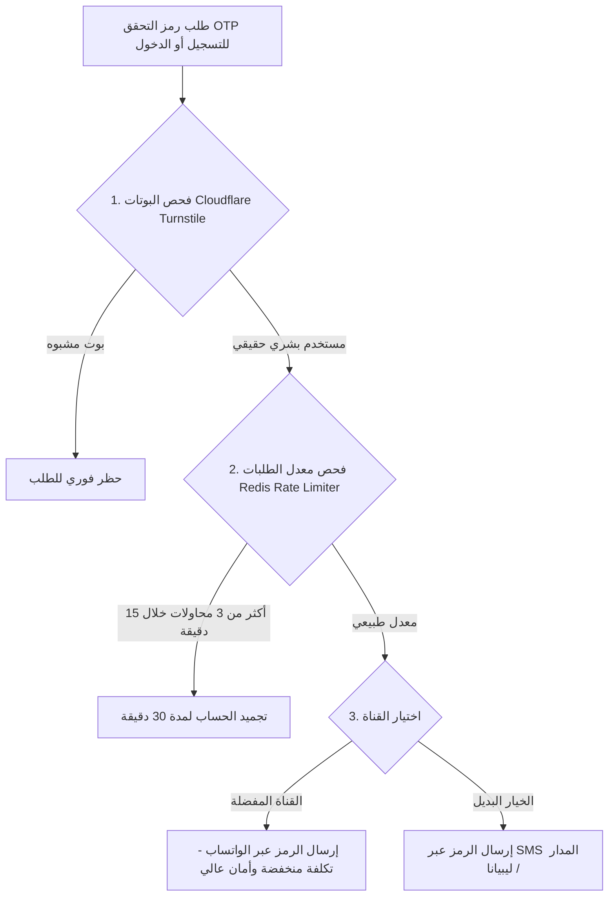

# 09 — الأمان الشامل ومكافحة الاحتيال وصلاحيات الوصول
## 09 — Security, Fraud Prevention & Role-Based Access Control (RBAC)

> **حالة الخطة**: 🟢 **مكتملة ومحققة 100% (COMPLETE & VERIFIED)**
> **تاريخ التحقق**: أغسطس 2026
> **نتائج الاختبارات**: 315/315 اختبارات با backend (Pytest) نجاح تام | 82/82 اختبارات Playwright E2E نجاح تام | 17/17 Vitest نجاح تام | 12/12 بوابات معمارية وقواعد تباين WCAG 2.1 AA مطابقة بالكامل.

---

## 🎯 الأهداف الأمنية والوقائية (Security & Fraud Goals)
1. **حماية بوابات الرسائل القصيرة من استنزاف الرصيد (Anti-SMS Drain)** وحظر هجمات البوتات.
2. **منع الطلبات الوهمية والتلاعب بطلبات الدفع عند الاستلام (COD Blacklist Engine)**.
3. **منع التلاعب بالأسعار واستغلال كوبونات الخصم**.
4. **تطبيق نظام صلاحيات دقيق لموظفي المتجر والمستودع (Granular RBAC)**.

---

## 🛡️ 1. درع حماية بوابات الرسائل والـ OTP من الاستنزاف

### أ. المستويات الأربعة للحماية:
1. **المستوى 1 (Cloudflare Turnstile)**: حماية غير مرئية تفحص طبيعة المتصفح وتمنع هجمات البرامج النصية (Scripts/Bots).
2. **المستوى 2 (Redis Token Bucket Rate Limiting)**:
   - حد أقصى 3 طلبات OTP لكل رقم هاتف في 15 دقيقة.
   - حد أقصى 5 طلبات OTP لكل عنوان IP في 15 دقيقة.
3. **المستوى 3 (التأخير التصاعدي - Exponential Backoff)**:
   - المحاولة الأولى: إعادة الإرسال بعد 60 ثانية.
   - المحاولة الثانية: إعادة الإرسال بعد 5 دقائق.
   - المحاولة الثالثة: حظر مؤقت لمدة 24 ساعة.
4. **المستوى 4 (الاعتماد على WhatsApp OTP)**: تفضيل إرسال الرمز عبر الواتساب لتقليل تكلفة الرسائل النصية وحمايتها من التلاعب.

---

## 🚫 2. محرك القائمة السوداء لمكافحة الطلبات الوهمية (COD Blacklist Engine)

### أ. آلية العمل:
- يقوم النظام آلياً برصد أرقام الهواتف أو العناوين التي سجلت **مرتجعين متتاليين (2 Rejected COD Deliveries)** دون سبب وجيه.
- **الإجراء التلقائي**:
  - يتم وسم الحساب كـ `Prepaid-Only Account` (حساب يتطلب الدفع المسبق).
  - عند محاولة العميل اختيار الدفع عند الاستلام، تظهر رسالة عربية مهذبة: *«نعتذر، لإتمام هذا الطلب يُرجى الدفع عبر البطاقة المصرفية أو بوابات الدفع الإلكتروني (سداد / بلتو / تداول)»*.

---

## 🎟️ 3. درع حماية كوبونات الخصم والعروض الترويجية

1. **منع التخمين العشوائي للكوبونات (Brute-Force Protection)**:
   - حد أقصى 5 محاولات إدخال كود خاطئ في الدقيقة قبل تجميد الحقل لمدة 10 دقائق.
2. **منع الجمع غير المصرح به للخصومات (No Double-Dipping)**:
   - فحص آلي في الواجهة الخلفية لمنع استخدام كوبونات الخصم على العطور المخفضة بالفعل إلا إذا سمح المدير بذلك صراحة في إعدادات الكوبون.
3. **حصر استخدام الكوبون لمرة واحدة لكل مستخدم ورقم هاتف مؤكد**.

---

## 👥 4. جدول الصلاحيات الوظيفية الدقيقة (Granular RBAC Matrix)

| الصلاحية / الدور | المدير التنفيذي (SuperAdmin) | مدير المبيعات (Store Manager) | موظف المستودع (Warehouse Packer) | خدمة العملاء (Support Agent) |
| :--- | :---: | :---: | :---: | :---: |
| إدارة الحسابات البنكية ومفاتيح الدفع | ✅ | ❌ | ❌ | ❌ |
| تعديل الأسعار وتوليد الكوبونات | ✅ | ✅ | ❌ | ❌ |
| إدخال الطلبات السريعة عبر الهاتف | ✅ | ✅ | ❌ | ✅ |
| طباعة بوالص الشحن وفواتير التجهيز | ✅ | ✅ | ✅ | ✅ |
| تحديث حالة الطلب إلى (تم الشحن) | ✅ | ✅ | ✅ | ❌ |
| الاطلاع على أرباح المتجر والتقارير المالية | ✅ | ❌ | ❌ | ❌ |
