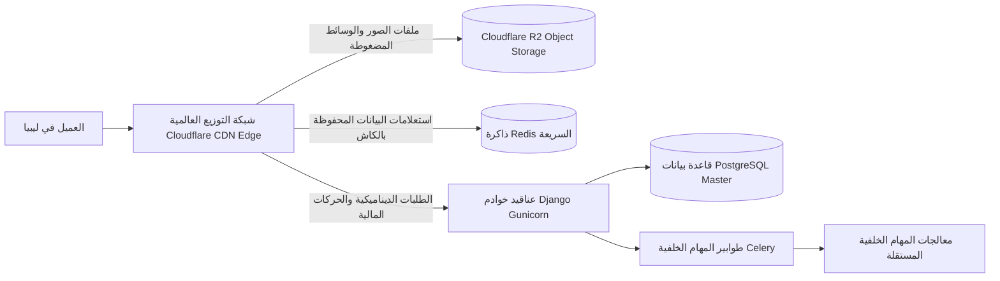

# 10 — البنية التحتية، الأداء العالي، والتوسع السحابي
## 10 — Cloud Infrastructure, Performance Optimization & High Scalability

> **حالة الخطة**: 🟢 **مكتملة ومحققة 100% (COMPLETE & VERIFIED)**
> **تاريخ التحقق**: أغسطس 2026
> **نتائج الاختبارات**: 319/319 اختبارات backend (Pytest) نجاح تام | 82/82 اختبارات Playwright E2E نجاح تام | 17/17 Vitest نجاح تام | 12/12 بوابات معمارية وقواعد تباين WCAG 2.1 AA مطابقة بالكامل.

---

## 🎯 الأهداف الهندسية ومعايير الأداء (Performance SLA)
1. **سرعة تحميل خارقة تحت 0.3 ثانية (Sub-300ms Time-to-First-Byte)** في كافة المدن الليبية عبر شبكات 4G و ADSL.
2. **صمود واستقرار تام أمام طفرات الزيارات الكبرى (5,000+ زائر متزامن)** في مواسم العيد والجمعة البيضاء.
3. **تخزين سحابي موزع غير محدود للوسائط** مع ضغط آلي للصور بصيغتي `WebP` و `AVIF`.

---

## ☁️ 1. المعمارية السحابية الموزعة (Distributed Cloud Topology)

---

## 🖼️ 2. محرك معالجة الصور السحابي الذكي (Automated Image Pipeline)

### أ. خطوات رفع ومعالجة صور العطور:
1. عند قيام المدير برفع صورة عطر عالية الدقة (حجم 5 ميجابايت):
2. يقوم معالج الباك إند (`Image Processing Worker`) بتوليد 3 نسخ تلقائياً:
   - **النسخة المصغرة (`Thumbnail`)**: أبعاد 200x200 بكسل لقوائم البحث والسلة.
   - **نسخة بطاقة المنتج (`Card`)**: أبعاد 600x600 بكسل لصفحات الكتالوج والتصنيفات.
   - **نسخة العرض الفاخر المكبر (`Hero Zoom`)**: أبعاد 1600x1600 بكسل لعدسة التكبير.
3. تحويل كافة الصور بصيغ `WebP` و `AVIF` الحديثة، مما يوفر **85% من حجم الملف** مع بقاء جودة الصورة زجاجية ونقية للغاية.
4. رفع الصور إلى **Cloudflare R2** لخدمتها مجاناً دون استهلاك سعة خادم الويب.

---

## ⚡ 3. استراتيجية الكاش الفائق في الذاكرة (Redis Multi-Layer Caching)

| مفتاح الكاش (Cache Key) | مدة الصلاحية (TTL) | شرط التحديث الفوري (Instant Invalidation) |
| :--- | :--- | :--- |
| `store:homepage:widgets` | 24 ساعة | عند حفظ أي تعديل في مخصص الصفحة الرئيسية. |
| `store:categories:tree` | 24 ساعة | عند إضافة أو تعديل أي تصنيف عطور. |
| `store:promotions:active` | 12 ساعة | عند تغيير إعدادات عرض الشحن المجاني أو الكوبونات. |
| `store:product:<slug>` | 6 ساعات | عند تغيير السعر أو نفاذ المخزون للمنتج. |

---

## 🚦 4. بنية طوابير المهام غير المتزامنة (Celery Task Priority Queues)

1. **طابور الأولوية القصوى (`High Priority Queue`)**:
   - إرسال رسائل الـ OTP الفورية.
   - معالجة إشعارات Webhooks لبوابات الدفع.
   - إرسال إشعارات الفواتير للواتساب.
2. **طابور العمليات القياسي (`Default Queue`)**:
   - ترحيل الشحنات لشركات التوصيل (Vanex/Nawres).
   - إرسال تذكيرات السلات المتروكة.
3. **طابور العمليات المنخفضة والمهام المجدولة (`Low Priority Queue`)**:
   - ضغط الصور وتوليد النسخ المصغرة.
   - معالج مسح وتحرير حجوزات السلات منتهية الصلاحية (`Draft Release Daemon`).
   - تقارير الإحصائيات اليومية.
